# Turbo Data Migration - Step Function Workflow

A modular turbo monorepo for AWS Step Function workflows triggered by EventBridge, built with TypeScript and AWS CDK following SOLID principles.

## 🏗️ Architecture

This project demonstrates a clean architecture approach to building AWS Step Functions:

```
EventBridge (every 5 min) → Step Function → Lambda → Workflow Execution
```

### 🔄 Detailed Flow Diagram

```mermaid
graph TB
    subgraph "🕐 EventBridge Scheduler"
        EB["EventBridge Rule<br/>Rate: 5 minutes"]
        EB_INPUT["Input Structure:<br/>executionId: $.id<br/>timestamp: $.time<br/>triggerSource: EventBridge"]
    end

    subgraph "🔄 Step Function State Machine"
        SF_START[Start Workflow]
        SF_INVOKE["Lambda Invoke<br/>workflowHandler"]
        SF_CHOICE{"Check Result<br/>success === true?"}
        SF_SUCCESS["Workflow Succeeded<br/>✅ Complete"]
        SF_FAIL["Workflow Failed<br/>❌ Error State"]
        SF_RETRY["Retry Logic<br/>Max 6 attempts<br/>Exponential backoff"]
    end

    subgraph "🏗️ Packages - Modular Architecture"
        subgraph "@repo/types"
            TYPES["TypeScript Interfaces<br/>WorkflowInput<br/>WorkflowOutput<br/>StepResult<br/>ExecutionContext"]
        end

        subgraph "@repo/lambda-handlers"
            LH_VALIDATE["Input Validation<br/>validateInput function"]
            LH_HANDLER["workflowHandler<br/>🔍 Logging & Tracing"]
            LH_FACTORY["WorkflowFactory<br/>createDataMigrationWorkflow"]
        end

        subgraph "@repo/step-function-core"
            ORCH["WorkflowOrchestrator<br/>🎛️ Main Controller"]
            
            subgraph "Step Executors"
                STEP1["ValidationStep<br/>✓ Input validation"]
                STEP2["DataProcessingStep<br/>⚙️ Business logic"]
                STEP_N["Future Steps<br/>🔧 Extensible"]
            end
            
            ERROR_HANDLER["DefaultErrorHandler<br/>🚨 Error management"]
        end
    end

    subgraph "☁️ AWS Infrastructure CDK"
        IAM_LAMBDA["IAM Role<br/>Lambda Execution"]
        IAM_SF["IAM Role<br/>Step Functions"]
        IAM_EB["IAM Role<br/>EventBridge"]
        CW_LOGS["CloudWatch Logs<br/>📊 Monitoring"]
        XRAY["X-Ray Tracing<br/>🔍 Distributed tracing"]
    end

    subgraph "📊 Execution Flow Details"
        CONTEXT["ExecutionContext<br/>executionId<br/>stateMachineName<br/>input: WorkflowInput"]
        
        STEP_RESULT["StepResult<br/>stepName<br/>success: boolean<br/>output?: object<br/>error?: string"]
        
        FINAL_OUTPUT["WorkflowOutput<br/>success: boolean<br/>executionId<br/>timestamp<br/>result?: object<br/>error?: string"]
    end

    %% Main Flow
    EB -->|Every 5 minutes| EB_INPUT
    EB_INPUT -->|Triggers| SF_START
    SF_START --> SF_INVOKE
    SF_INVOKE -->|Success/Error| SF_CHOICE
    SF_CHOICE -->|success: true| SF_SUCCESS
    SF_CHOICE -->|success: false| SF_FAIL
    SF_INVOKE -->|Lambda Error| SF_RETRY
    SF_RETRY -->|Retry| SF_INVOKE
    SF_RETRY -->|Max retries exceeded| SF_FAIL

    %% Lambda Handler Flow
    SF_INVOKE --> LH_HANDLER
    LH_HANDLER --> LH_VALIDATE
    LH_VALIDATE -->|Valid input| LH_FACTORY
    LH_VALIDATE -->|Invalid input| ERROR_HANDLER
    LH_FACTORY --> ORCH

    %% Workflow Orchestration
    ORCH --> CONTEXT
    CONTEXT --> STEP1
    STEP1 -->|Success| STEP2
    STEP1 -->|Error| ERROR_HANDLER
    STEP2 -->|Success| STEP_N
    STEP2 -->|Error| ERROR_HANDLER
    STEP_N --> STEP_RESULT
    STEP_RESULT --> FINAL_OUTPUT
    ERROR_HANDLER --> FINAL_OUTPUT
    FINAL_OUTPUT --> SF_CHOICE

    %% Type Dependencies
    TYPES -.->|Used by| LH_HANDLER
    TYPES -.->|Used by| ORCH
    TYPES -.->|Used by| STEP1
    TYPES -.->|Used by| STEP2

    %% Infrastructure Dependencies
    IAM_LAMBDA -.->|Permissions| LH_HANDLER
    IAM_SF -.->|Permissions| SF_INVOKE
    IAM_EB -.->|Permissions| EB
    CW_LOGS -.->|Logs| LH_HANDLER
    CW_LOGS -.->|Logs| SF_INVOKE
    XRAY -.->|Tracing| LH_HANDLER

    %% Styling
    classDef eventbridge fill:#ff9999,stroke:#333,stroke-width:2px
    classDef stepfunction fill:#99ccff,stroke:#333,stroke-width:2px
    classDef lambda fill:#99ff99,stroke:#333,stroke-width:2px
    classDef packages fill:#ffcc99,stroke:#333,stroke-width:2px
    classDef infrastructure fill:#cc99ff,stroke:#333,stroke-width:2px
    classDef success fill:#90EE90,stroke:#333,stroke-width:2px
    classDef error fill:#FFB6C1,stroke:#333,stroke-width:2px

    class EB,EB_INPUT eventbridge
    class SF_START,SF_INVOKE,SF_CHOICE stepfunction
    class SF_SUCCESS success
    class SF_FAIL,SF_RETRY error
    class LH_VALIDATE,LH_HANDLER,LH_FACTORY,ORCH,STEP1,STEP2,STEP_N lambda
    class TYPES,ERROR_HANDLER packages
    class IAM_LAMBDA,IAM_SF,IAM_EB,CW_LOGS,XRAY infrastructure
```



### 📦 Package Interaction Diagram

```mermaid
graph TB
    subgraph "Turbo Monorepo Structure"
        subgraph "📁 apps"
            CDK["infrastructure<br/>🏗️ AWS CDK App"]
        end

        subgraph "📁 packages"
            TYPES_PKG["@repo/types<br/>📋 TypeScript Definitions"]
            CORE_PKG["@repo/step-function-core<br/>⚙️ Business Logic"]
            LAMBDA_PKG["@repo/lambda-handlers<br/>🔧 AWS Lambda Functions"]
            TS_CONFIG["@repo/typescript-config<br/>⚙️ Shared TS Config"]
        end
    end

    subgraph "🔗 Dependency Flow"
        TYPES_PKG --> CORE_PKG
        TYPES_PKG --> LAMBDA_PKG
        TYPES_PKG --> CDK
        CORE_PKG --> LAMBDA_PKG
        LAMBDA_PKG --> CDK
        TS_CONFIG --> TYPES_PKG
        TS_CONFIG --> CORE_PKG
        TS_CONFIG --> LAMBDA_PKG
        TS_CONFIG --> CDK
    end

    subgraph "🏗️ Build Process Turbo"
        BUILD_TYPES["Build @repo/types"]
        BUILD_CORE["Build @repo/step-function-core"]
        BUILD_LAMBDA["Build @repo/lambda-handlers"]
        BUILD_CDK["Build infrastructure"]
        
        BUILD_TYPES --> BUILD_CORE
        BUILD_TYPES --> BUILD_LAMBDA
        BUILD_CORE --> BUILD_LAMBDA
        BUILD_LAMBDA --> BUILD_CDK
    end

    classDef app fill:#ff9999,stroke:#333,stroke-width:2px
    classDef package fill:#99ccff,stroke:#333,stroke-width:2px
    classDef config fill:#ffcc99,stroke:#333,stroke-width:2px
    classDef build fill:#99ff99,stroke:#333,stroke-width:2px

    class CDK app
    class TYPES_PKG,CORE_PKG,LAMBDA_PKG package
    class TS_CONFIG config
    class BUILD_TYPES,BUILD_CORE,BUILD_LAMBDA,BUILD_CDK build
```



### 🎯 SOLID Principles in Action


### 📁 Project Structure

```
turbo-data-migration/
├── apps/
│   └── infrastructure/          # AWS CDK Infrastructure
├── packages/
│   ├── types/                   # Shared TypeScript types
│   ├── step-function-core/      # Business logic & workflow orchestration
│   ├── lambda-handlers/         # AWS Lambda function handlers
│   └── typescript-config/       # Shared TypeScript configuration
└── turbo.json                   # Turbo configuration
```

## 🎯 SOLID Principles Implementation

### Single Responsibility Principle (SRP)
- **`@repo/types`**: Only contains type definitions
- **`@repo/step-function-core`**: Only handles workflow orchestration
- **`@repo/lambda-handlers`**: Only handles AWS Lambda integration
- **`infrastructure`**: Only handles AWS resource provisioning

### Open/Closed Principle (OCP)
- Workflow steps implement `StepExecutor` interface - easily extensible
- Error handlers implement `ErrorHandler` interface - customizable

### Liskov Substitution Principle (LSP)
- All step implementations can be substituted without breaking the workflow
- Different error handlers can be swapped seamlessly

### Interface Segregation Principle (ISP)
- `WorkflowProcessor`, `StepExecutor`, and `ErrorHandler` are focused interfaces
- No client is forced to depend on methods it doesn't use

### Dependency Inversion Principle (DIP)
- `WorkflowOrchestrator` depends on abstractions, not concrete implementations
- Easy to inject different steps and error handlers

## 🚀 Getting Started

### Prerequisites
- Node.js >= 18
- AWS CLI configured
- AWS CDK CLI installed: `npm install -g aws-cdk`

### Installation

```bash
# Install dependencies
npm install

# Build all packages
npm run build

# Bootstrap CDK (first time only)
cd apps/infrastructure && npx cdk bootstrap

# Deploy infrastructure
npm run cdk:deploy
```

### Development

```bash
# Build all packages
npm run build

# Watch mode for development
npm run dev

# Type checking
npm run check-types

# Linting
npm run lint

# Clean build artifacts
npm run clean
```

## 📋 Components

### 1. EventBridge Schedule
- Triggers every 5 minutes
- Configurable via `EventBridgeConfig`
- Sends structured input to Step Function

### 2. Step Function State Machine
- Orchestrates the workflow execution
- Includes error handling and retry logic
- Enhanced logging and X-Ray tracing

### 3. Lambda Function
- Executes the actual workflow logic
- Uses AWS Lambda Powertools for observability
- Validates input and handles errors gracefully

### 4. Workflow Steps
- **ValidationStep**: Validates input data
- **DataProcessingStep**: Processes the data
- Easily extensible by implementing `StepExecutor`

## 🔧 Configuration

### Step Function Configuration
```typescript
const stepFunctionConfig: StepFunctionConfig = {
  name: 'DataMigrationWorkflow',
  timeout: 300, // 5 minutes
  retryAttempts: 3,
};
```

### EventBridge Configuration
```typescript
const eventBridgeConfig: EventBridgeConfig = {
  ruleName: 'DataMigrationSchedule',
  scheduleExpression: 'rate(5 minutes)',
  description: 'Triggers data migration workflow every 5 minutes',
};
```

## 📦 Package Details

### @repo/types
Core TypeScript interfaces and types used across all packages.

### @repo/step-function-core
Business logic implementation with:
- Workflow orchestration
- Step execution framework
- Error handling
- Factory pattern for workflow creation

### @repo/lambda-handlers
AWS Lambda function handlers with:
- Input validation
- Structured logging
- Distributed tracing
- Error handling

### infrastructure
AWS CDK constructs for:
- Step Function state machine
- Lambda functions
- EventBridge rules
- IAM roles and policies
- CloudWatch logs

## 🚀 Deployment

### Deploy to AWS
```bash
# Synthesize CloudFormation templates
npm run cdk:synth

# Deploy infrastructure
npm run cdk:deploy

# Destroy infrastructure (cleanup)
npm run cdk:destroy
```

### CDK Outputs
After deployment, you'll get:
- Step Function ARN
- Lambda Function Name
- CloudWatch Log Groups

## 🔍 Monitoring

The deployment includes:
- **CloudWatch Logs**: Structured logging for both Step Function and Lambda
- **X-Ray Tracing**: Distributed tracing for performance monitoring
- **Lambda Powertools**: Enhanced observability

## 🔧 Extending the Workflow

### Adding New Steps
1. Implement the `StepExecutor` interface:
```typescript
export class MyCustomStep implements StepExecutor {
  async execute(context: ExecutionContext): Promise<StepResult> {
    // Your implementation
  }
}
```

2. Add to the workflow factory:
```typescript
const steps = [
  new ValidationStep(),
  new DataProcessingStep(),
  new MyCustomStep(), // Add here
];
```

### Custom Error Handling
Implement the `ErrorHandler` interface:
```typescript
export class CustomErrorHandler implements ErrorHandler {
  async handle(error: Error, context: ExecutionContext): Promise<WorkflowOutput> {
    // Your error handling logic
  }
}
```

## 🎯 Benefits

- **Modularity**: Clear separation of concerns
- **Testability**: Each component can be tested in isolation
- **Maintainability**: SOLID principles ensure code quality
- **Scalability**: Easy to add new workflow steps
- **Observability**: Built-in logging and tracing
- **Type Safety**: Full TypeScript support
